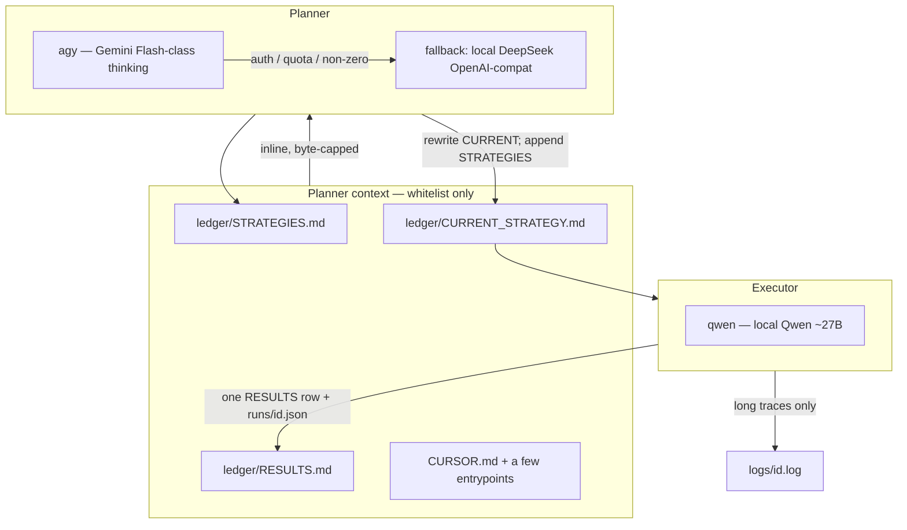

# Kaggle Agent Loop

Token-thrifty Deotte-style experiment loop: a **planner** proposes the next
strategy from a small file whitelist; a **Qwen Code** executor implements it;
results append to compact ledgers. Full traces stay on disk. The long loop
runs on local / cheap CLIs — not inside Cursor.

Default example: Kaggle Playground **S6E9** (Predicting Electric Vehicle
Purchases, ROC AUC). The scaffolding is competition-agnostic.

## Why this exists

Chris Deotte’s agentic Kaggle workflow works because it runs **many fast
experiments**, treats **CV as ground truth**, and **logs every attempt**
(EDA → baselines → feature engineering → stack). Doing that inside Cursor
with a model that eagerly reads `logs/` fills the context window and burns
credits (local DeepSeek + Fable both did).

This repo forces the opposite:

- The planner is given **only** the files in `config/planner_reads.yaml`.
- The orchestrator **inlines** those files (byte-capped). It never opens
  `logs/`, `ledger/runs/`, or data dumps.
- Long output goes to `logs/<id>.log`. `RESULTS.md` stays one row per run.
- Antigravity / Qwen Code / Ollama do the looping. Cursor is for editing
  this harness, not for 50 overnight iterations.

## Architecture



Two roles per iteration:

| Role | Primary | Fallback | Writes |
|------|---------|----------|--------|
| Planner (strategy) | Google Antigravity CLI `agy` | Local DeepSeek via OpenAI-compatible HTTP | Full rewrite of `CURRENT_STRATEGY.md`; one line in `STRATEGIES.md` |
| Executor (code + run) | Qwen Code CLI `qwen` → local Qwen | — | Code under `competition_root`; one RESULTS row; `logs/<id>.log` |

Orchestrator: `plan → execute → record`, then stop on max iterations,
target CV, or consecutive failures.

## Token-budget rules

1. **Whitelist is law.** Planner context = `config/planner_reads.yaml` only.
   Deny list wins, even if a path is also listed under `always`.
2. **Never pass `logs/`.** Not to the planner, not into `RESULTS.md`, not
   back into the executor chat (tail ≤20 lines if you must debug).
3. **Ledgers stay tabular.** One strategy line, one result row, optional
   metrics-only `ledger/runs/<id>.json` (also denied from the planner).
4. **Byte caps.** Default 24 KiB/file and 80 KiB total. Truncation is marked
   in the prompt so the model does not assume it saw the whole file.
5. **No Cursor for the long loop.** Use `python -m loop run` on the Mac
   Studio (or any box with the CLIs). Reserve Cursor for harness changes.

`python -m loop show-whitelist` prints exactly what the planner would see.

## Ledger format

Designed to stay small enough to re-read every iteration:

| File | Shape | Mutation |
|------|--------|----------|
| `ledger/STRATEGIES.md` | `id \| date \| phase \| one-liner` | append |
| `ledger/RESULTS.md` | `id \| status \| cv \| lb \| notes` | append |
| `ledger/CURRENT_STRATEGY.md` | executable spec | **rewrite every plan** |
| `ledger/runs/<id>.json` | `{id,status,cv,lb,notes,phase}` | write; planner-invisible |
| `logs/<id>.log` | anything long | disk only |

`phase` is `eda | baseline | fe | stack` so the planner can follow the
Deotte playbook without opening experiment dumps.

## Install

```bash
git clone https://github.com/wTaylorBickelmann/kaggle-agent-loop
cd kaggle-agent-loop
python3 -m venv .venv && source .venv/bin/activate
pip install -e ".[dev]"
cp .env.example .env
```

Smoke-test (no CLIs, no GPU, no network):

```bash
python -m loop run --iterations 1 --dry-run
```

## Wire the CLIs

### 1) Planner — Antigravity (`agy`)

Install the Antigravity CLI and authenticate once in an interactive
session (headless mode reuses cached credentials). Docs:
[Headless mode](https://antigravity.google/docs/cli/headless/).

```bash
agy models
```

The catalog is two columns: **slug** (left) and display name (right).
Pin a thinking Flash-class model. Examples (names move — trust `agy models`):

```text
gemini-3.5-flash-high     Gemini 3.5 Flash (High)
gemini-3.6-flash-high     Gemini 3.6 Flash (High)
```

Set in `.env`:

```bash
AGY_MODEL=gemini-3.5-flash-high
AGY_EFFORT=high
```

This repo always invokes `agy` as a **non-interactive** subprocess:

```text
agy --model "$AGY_MODEL" --effort high --output-format json --print-timeout 10m -p "$PROMPT"
```

`--model` / `--effort` are placed **before** `-p`. Putting `-p` first can
make some versions swallow the model flag and silently use the default.

The planner prompt already contains the whitelist. `agy` is instructed
**not** to open other files. The orchestrator does not pass `--dangerously-skip-permissions`.

### 2) Planner fallback — local DeepSeek

If `agy` exits non-zero, is missing, or returns auth/quota/credit errors,
the loop automatically calls a local OpenAI-compatible endpoint
(Ollama / vLLM / llama.cpp):

```bash
# Ollama example
ollama pull deepseek-r1:32b   # or your preferred local DeepSeek

DEEPSEEK_BASE_URL=http://127.0.0.1:11434/v1
DEEPSEEK_MODEL=deepseek-r1:32b
DEEPSEEK_API_KEY=ollama
```

Force the fallback (skip Antigravity):

```bash
LOOP_DISABLE_ANTIGRAVITY=1
# or
LOOP_PLANNER=deepseek
```

DeepSeek is chat-completions only (no tools), so it cannot wander into
`logs/`. That is the cheap overnight planner.

### 3) Executor — Qwen Code (`qwen`) + local Qwen ~27B

Install [Qwen Code](https://qwenlm.github.io/qwen-code-docs/) and point it
at a local OpenAI-compatible server. Headless flags this repo uses:

```text
qwen -p "$PROMPT" \
  --auth-type openai \
  --model "$OPENAI_MODEL" \
  --openai-base-url "$OPENAI_BASE_URL" \
  --openai-api-key "$OPENAI_API_KEY" \
  --output-format text \
  --yolo \
  --max-wall-time 45m \
  --include-directories "$LOOP_ROOT"
```

```bash
# Ollama example — pick whatever 27B-class tag you actually have
ollama pull qwen3.6:27b        # or qwen3.8-27b / qwen2.5-coder:32b / …

OPENAI_BASE_URL=http://127.0.0.1:11434/v1
OPENAI_MODEL=qwen3.6:27b
OPENAI_API_KEY=ollama
```

`--yolo` auto-approves tool calls so training can run unattended. Use it
only on a machine you trust. The executor prompt forbids dumping logs
into chat; it must append one RESULTS row and write `logs/<id>.log`.

## Kick off on a Mac Studio

1. Install Python 3.11+, `agy`, `qwen`, and Ollama (or vLLM).
2. Pull a DeepSeek planner model and a Qwen ~27B executor model.
3. Authenticate `agy` once (`agy models` should list Gemini Flash).
4. Point `COMPETITION_ROOT` at your existing tabular checkout
   (see [docs/ev-purchase-bridge.md](docs/ev-purchase-bridge.md)).
5. Confirm the whitelist:

   ```bash
   python -m loop show-whitelist
   ```

6. Run:

   ```bash
   python -m loop run --iterations 20
   # or
   ./scripts/run-loop.sh 20
   ```

Suggested memory split: do **not** keep both 32B DeepSeek and 27B Qwen
resident if unified memory is tight. They run in sequence (plan, then
execute), so Ollama can page one out.

Useful commands:

```bash
python -m loop plan-once              # rewrite CURRENT_STRATEGY.md only
python -m loop execute-once           # run the current spec
python -m loop run --iterations 5
python -m loop run --iterations 1 --dry-run
```

Stop conditions live in `config/loop.yaml`: `max_iterations`, `target_cv`,
`max_consecutive_failures`.

## Pointing at a competition

This repo does not clone competition code or data. Set
`COMPETITION_ROOT` (or `competition.root` in YAML) at an existing
checkout. For the EV / S6E9 default, see
[docs/ev-purchase-bridge.md](docs/ev-purchase-bridge.md).

Add that repo’s real feature/model entrypoints to
`config/planner_reads.yaml` `optional:` — missing files are skipped.

## Package layout

```
src/loop/
  cli.py             python -m loop {run,plan-once,execute-once,show-whitelist}
  orchestrator.py    plan → execute → record + stop conditions
  context.py         whitelist assembly + deny + byte caps
  ledger.py          compact markdown / JSON writers
  adapters/
    antigravity.py   PlannerAntigravity
    deepseek.py      PlannerDeepSeek
    qwen.py          ExecutorQwenCode
    mock.py          dry-run / CI
    fallback.py      agy → DeepSeek
config/loop.yaml
config/planner_reads.yaml
prompts/{planner,executor}.md
ledger/{STRATEGIES,RESULTS,CURRENT_STRATEGY}.md
```

Config is YAML with `${VAR:-default}` expansion. `.env` is loaded from
the loop root (see `.env.example`).

## Relation to Deotte’s workflow

Same playbook, different I/O:

| Deotte / Claude Code loop | This loop |
|---------------------------|-----------|
| EDA → baselines → FE → stack | Encoded as `phase` on each strategy |
| CV decides what to keep | `RESULTS.md` + optional `target_cv` |
| Log every attempt | One ledger row + `logs/<id>.log` |
| Drag experiment files into chat | **Forbidden** — whitelist + inline caps |
| Many GPU-fast experiments | Executor runs whatever the spec says; you still want GPU GBDT in the competition repo |
| Human-in-the-loop in a coding agent | Local `agy` / `qwen` so Cursor is not on the clock |

## Development

```bash
pip install -e ".[dev]"
ruff check src tests
pytest
python -m loop run --iterations 1 --dry-run
```

CI (`.github/workflows/ci.yml`) runs lint, tests, and that dry-run —
**mock adapters only**. No `agy`, `qwen`, or GPU.

`--dry-run` from the repo root appends a mock `s00N` row to the sample
ledgers. Use `--root /tmp/some-copy` if you want to keep starters clean.
